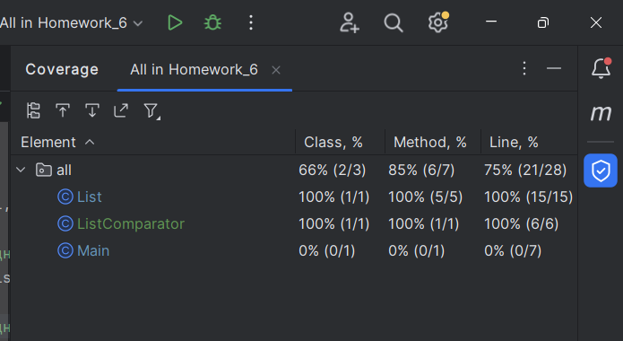

### Код программы:
Код программы находится [здесь](https://github.com/SergeiSolaev/Unit_test/tree/main/Homework_6/src/main/java)
### Код тестов:
Код тестов находится [здесь](https://github.com/SergeiSolaev/Unit_test/tree/main/Homework_6/src/test/java)
### Отчёт покрытия тестами:

### Объяснение сценария покрытия тестами:
Класс List был проверен на предмет создания списка чисел 
нужной длины, а так же на то, что не создаётся пустой список чисел и на правильность вычисления среднего значения чисел списка.

Класс ListComparator был проверен на три возможных варианта результата сравнения. 

Так же протестировал взаимодействие между методами.